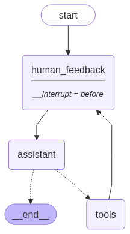

# Human in the Loop (Module 3)

Let's put some humans in the loop.


## Streaming

LangGraph supports a few [different streaming modes](https://langchain-ai.github.io/langgraph/how-tos/stream-values/) for [graph state](https://langchain-ai.github.io/langgraph/how-tos/stream-values/):
 
* `values`: This streams the full state of the graph after each node is called.
* `updates`: This streams updates to the state of the graph after each node is called.


Stream in the `updates` mode (the output of the current node):

```python
config = {"configurable": {"thread_id": "1"}}
# Start conversation
chunks = []
for chunk in graph.stream({"messages": [HumanMessage(content="hi! I'm Lance")]}, config, stream_mode="updates"):
    chunks.append(chunk)
    # print(chunk)
    chunk['conversation']["messages"].pretty_print()
chunks
```

Stream in the `values` mode (the output of the current node + all the previous nodes):

```python
config = {"configurable": {"thread_id": "2"}}
# Start conversation
input_message = HumanMessage(content="hi! I'm Lance")
events = []
for event in graph.stream({"messages": [input_message]}, config, stream_mode="values"):
    events.append(event)
    # print(chunk)
    print('vvv' * 25)
    for m in event['messages']:
        m.pretty_print()
    print('---' * 25)
events
```

The streaming of the tokens within the current node with the `astream_events` method:

```python
config = {'configurable': {'thread_id': '3'}}
input_message = HumanMessage(content='Tell me about the current conflicts that Israel is involved in.')
async for event in graph.astream_events({'messages': [input_message]}, config, version='v2'):
    # print('vvv')
    # print(f"Node: {event['metadata'].get('langgraph_node', '')}\n"
    #       f"Type: {event['event']}\n"
    #       f"Name: {event['name']}")
    # print('^^^')
    if event['event'] == 'on_chat_model_stream':
        data = event['data']
        print(data['chunk'].content, end='')
```


## Breakpoints


`human-in-the-loop' approach brings several advantages:
- _approval_ of the inputs
- _debugging_ 
- _editing_ the current state of the graph

To start the strimming do:
```python
for event in graph.stream(initial_input, config, stream_mode="values"):
    event['messages'][-1].pretty_print()
```

User approval:
```python
user_approval = input('Do you want to call the tool? yes or no')
```

The continuation:
```python
if user_approval.lower() == 'yes':
    for event in graph.stream(None, config, stream_mode='values'):
        event['messages'][-1].pretty_print()
else:
    print('operation cancelled by user')
```

When we invoke the graph with `None`, it will just continue from the last state checkpoint!


For clarity, LangGraph will re-emit the current state, which contains the `AIMessage` with tool call.

And then it will proceed to execute the following steps in the graph, which start with the tool node.

We see that the tool node is run with this tool call, and it's passed back to the chat model for our final answer.


## Editing Graph State

The trick is to create a dummy node:
```python
def human_feedback(state: MessagesState):
    pass
```

To update a workflow:
```python
def workflow_hil():
    # define workflow
    i_workflow = StateGraph(State)
    # nodes
    i_workflow.add_node('assistant', assistant)
    i_workflow.add_node('tools', ToolNode(tools))
    i_workflow.add_node('human_feedback', human_feedback)
    # edges
    i_workflow.add_edge(START, 'human_feedback')
    i_workflow.add_edge('human_feedback', 'assistant')
    i_workflow.add_conditional_edges('assistant', tools_condition)
    i_workflow.add_edge('tools', 'human_feedback')
    return i_workflow

workflow = workflow_hil()
graph = workflow.compile(interrupt_before=['human_feedback'], checkpointer=memory)
# graph = workflow.compile()
# print(graph.get_graph().draw_ascii())
display(Image(graph.get_graph().draw_mermaid_png()))
```



To update state with the `as_node` parameter:
```python
thread = {"configurable": {"thread_id": "5"}}
initial_input = {"messages": "Multiply 2 and 3"}

# Run the graph until the first interruption
for event in graph.stream(initial_input, thread, stream_mode="values"):
    event["messages"][-1].pretty_print()

# Get user input
user_input = input("Tell me how you want to update the state: ")

# We now update the state as if we are the human_feedback node
graph.update_state(thread, {"messages": user_input}, as_node="human_feedback")

# Continue the graph execution
for event in graph.stream(None, thread, stream_mode="values"):
    event["messages"][-1].pretty_print()

# to continue after tools
for event in graph.stream(None, thread, stream_mode="values"):
    event["messages"][-1].pretty_print()
```

## Dynamic Breakpoints

Sometimes it is helpful to allow the graph dynamically interrupt itself.

This is an internal breakpoint, and can be achieved using `NodeInterrupt`. This has a few specific benefits: 

(1) you can do it conditionally (from inside a node based on developer-defined logic).

(2) you can communicate to the user why its interrupted (by passing whatever you want to the `NodeInterrupt`).


```python
from langgraph.errors import NodeInterrupt

def human_feedback(state: State):
    if len(state['messages'][-1].content) == 0:
        raise NodeInterrupt('Please, provide the question')
    return state
```

```python
state = graph.get_state(thread)
print(state.next)
print(state.interrupts[0].value)
```


## Time Travel

Let's see how LangGraph supports _debugging_ by using **time travel**.

We can use `get_state_history` to look at the whole history of states that were in the execution.

```python
all_states = [s for s in graph.get_state_history(thread)]
```

We can re-run our agent from any of the prior steps.


It does not _re-executes_ the graph (just replays) because it knows it already executed the state previously.

What if we want to run from that same step, but with a different input.

This is **forking**.


```python
to_fork = all_states[-2]
to_fork.values["messages"]
to_fork.config
```

Let's modify the state at this checkpoint.

We can just run `update_state` with the `checkpoint_id` supplied. 

Remember how our reducer on `messages` works: 

* It will append, unless we supply a message ID.
* We supply the message ID to overwrite the message, rather than appending to state!

So, to overwrite the the message, we just supply the message ID, which we have `to_fork.values["messages"].id`.

```python
fork_config = graph.update_state(
    to_fork.config,
    {"messages": [HumanMessage(content='Multiply 5 and 3', 
                               id=to_fork.values["messages"][0].id)]},
)
```

This creates a new, forked checkpoint.
 
But, the metadata - e.g., where to go next - is perserved! 

We can see the current state of our agent has been updated with our fork.

Now, when we stream, the graph knows this checkpoint has never been executed.

So, the graph runs, rather than simply re-playing.

```python
for event in graph.stream(None, fork_config, stream_mode="values"):
    event['messages'][-1].pretty_print()
```

Now, we can see the current state is the end of our agent run.

```python
graph.get_state({'configurable': {'thread_id': '1'}})
```
