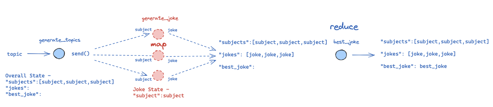

# Building Your Assistant (Module 4)

Here, we will bring together all the concepts we've learned previously into a useful project where we will build an assistant that we can customize as we wish for whatever use-cases. 

But first, let's introduce several important concepts.

## Parallel Node Execution

To update the state in parallel you need to construct the reducer. To use an existing one such as `operator.add` or to construct the custom one: 
```python
def sorting_reducer(left, right):
    if not isinstance(left, list):
        left = [left]
    if not isinstance(right, list):
        right = [right]
    return sorted(left + right, reverse=False)

class State(TypedDict):
    state: Annotated[list, sorting_reducer]
```

The nodes can be callable classes:
```python
class ReturnNodeValue:
    def __init__(self, node_secret: str):
        self._value = node_secret

    def __call__(self, state: State) -> Any:
        print(f"Reassigning <<{self._value}>> to {state['state']}")
        return {'state': [self._value]}
```


A real-world example of a useful parallel schema is the search agent:
```python
class State(TypedDict):
    question: str
    answer: str
    context: Annotated[list, sorting_reducer]
#%%
# ------------------------------------------------------ #
# NODES
# ------------------------------------------------------ #
def search_web(state: State):
    """ Retrieve docs from web search """
    tavily_search = TavilySearchResults(max_results=3)
    search_docs = tavily_search.invoke(state['question'])
    # Format
    formatted_search_docs = "\n\n---\n\n".join(
        [
            f'<Document href="{doc["url"]}">\n{doc["content"]}\n</Document>'
            for doc in search_docs
        ]
    )

    return {"context": [formatted_search_docs]}


def search_wikipedia(state: State):
    """ Retrieve docs from wikipedia """
    search_docs = WikipediaLoader(query=state['question'], load_max_docs=2).load()

    # Format
    formatted_search_docs = "\n\n---\n\n".join(
        [
            f'<Document source="{doc.metadata["source"]}" page="{doc.metadata.get("page", "")}">\n{doc.page_content}\n</Document>'
            for doc in search_docs
        ]
    )

    return {"context": [formatted_search_docs]}


def generate_answers(state: State):
    """ Node to answer a question """
    context = state['context']
    question = state['question']

    answer_instructions = f"""Answer the question {question} using this context: {context}"""

    answer = chat_llm.invoke([SystemMessage(content=answer_instructions)] + [HumanMessage(content="Answer the question.")])

    return {"answer": answer}
#%%
# ------------------------------------------------------ #
# BUILDERS
# ------------------------------------------------------ #
def workflow_search():
    builder = StateGraph(State)
    # nodes
    builder.add_node(search_web)
    builder.add_node(search_wikipedia)
    builder.add_node(generate_answers)
    # edges
    builder.add_edge(START, 'search_wikipedia')
    builder.add_edge(START, 'search_web')
    builder.add_edge('search_wikipedia', 'generate_answers')
    builder.add_edge('search_web', 'generate_answers')
    builder.add_edge('generate_answers', END)
    return builder
#%%
# ------------------------------------------------------ #
# COMPILE
# ------------------------------------------------------ #
workflow = workflow_search()
graph = workflow.compile()
display(Image(graph.get_graph().draw_mermaid_png()))
#%%
# ------------------------------------------------------ #
# INVOCATIONS
# ------------------------------------------------------ #
result = graph.invoke({'question': 'What is femboy?'})
print(result['answer'].content)
```


## Sub-Graphs


Sub-graphs allow you to create and manage different states in different parts of your graph. 

This is particularly useful for multi-agent systems, with teams of agents that each have their own state.

Let's consider a toy example:

* I have a system that accepts logs
* It performs two separate sub-tasks by different agents (summarize logs, find failure modes)
* I want to perform these two operations in two different sub-graphs.

The most critical thing to understand is how the graphs communicate! 

In short, communication is **done with over-lapping keys**: 

* The sub-graphs can access `docs` from the parent
* The parent can access `summary/failure_report` from the sub-graphs


```python
import os
from typing import *
import operator
from dotenv import load_dotenv
load_dotenv()
from IPython.display import Image, display
from langgraph.graph import StateGraph, START, END, MessagesState
#%%
# ------------------------------------------------------ #
# STATES
# ------------------------------------------------------ #
class Log(TypedDict):
    id: str
    question: str
    docs: Optional[List]
    answer: str
    grade: Optional[int]
    grader: Optional[int]
    feedback: Optional[int]
#%%
# ------------------------------------------------------ #
# FAILURE ANALYSIS SUB-GRAPH
# ------------------------------------------------------ #
# states
class FailureAnalysisState(TypedDict):
    cleaned_logs: List[Log]
    failures: List[Log]
    fa_summary: str
    processed_logs: List[str]

class FailureAnalysisOutputState(TypedDict):
    fa_summary: str
    processed_logs: List[str]


# nodes
def get_failures(state):
    cleaned_logs = state['cleaned_logs']
    failures = [log for log in cleaned_logs if 'grade' in log]
    return {'failures': failures}


def generate_summary(state):
    failures = state['failures']
    fa_summary = 'Poor quality retrieval of Chroma docs.'
    return {
        'fa_summary': fa_summary,
        'processed_logs': [f"failure-analysis-on-log-{failure['id']}" for failure in failures]
    }

# builder
fa_builder = StateGraph(FailureAnalysisState, output=FailureAnalysisOutputState)
# nodes
fa_builder.add_node(get_failures)
fa_builder.add_node(generate_summary)
# edges
fa_builder.add_edge(START, 'get_failures')
fa_builder.add_edge('get_failures', 'generate_summary')
fa_builder.add_edge('generate_summary', END)
# compile
graph = fa_builder.compile()
display(Image(graph.get_graph().draw_mermaid_png()))
#%%
# ------------------------------------------------------ #
# QUESTION SUMMARIZATION SUB-GRAPH
# ------------------------------------------------------ #
# states
class QuestionSummarizationState(TypedDict):
    cleaned_logs: List[Log]
    qs_summary: str
    report: str
    processed_logs: List[str]

class QuestionSummarizationOutputState(TypedDict):
    report: str
    processed_logs: List[str]


# nodes
def generate_summary(state):
    cleaned_logs = state['cleaned_logs']
    summary = 'Questions focused on usage of ChatOllama and Chroma vector store.'
    return {
        'qs_summary': summary,
        'processed_logs': [f"summary-on-log-{log['id']}" for log in cleaned_logs]
    }


def send_to_slack(state):
    qs_summary = state['qs_summary']
    report = 'super duper report from Slack'
    return {'report': report}


# builder
qs_builder = StateGraph(QuestionSummarizationState, output=QuestionSummarizationOutputState)
# nodes
qs_builder.add_node(generate_summary)
qs_builder.add_node(send_to_slack)
# edges
qs_builder.add_edge(START, 'generate_summary')
qs_builder.add_edge('generate_summary', 'send_to_slack')
qs_builder.add_edge('send_to_slack', END)
# compile
graph = qs_builder.compile()
display(Image(graph.get_graph().draw_mermaid_png()))
#%%
# ------------------------------------------------------ #
# PARENT GRAPH
# ------------------------------------------------------ #
# state
class EntryGraphState(TypedDict):
    raw_logs: List[Log]
    # cleaned_logs: Annotated[List[Log], operator.add]
    cleaned_logs: List[Log]
    fa_summary: str  # FA
    report: str  # QS
    processed_logs: Annotated[List[int], operator.add]


# nodes
def clean_logs(state):
    raw_logs = state['raw_logs']
    cleaned_logs = raw_logs
    return {'cleaned_logs': cleaned_logs}


# builder
entry_builder = StateGraph(EntryGraphState)
# nodes
entry_builder.add_node(clean_logs)
entry_builder.add_node('question_summarization', qs_builder.compile())
entry_builder.add_node('failure_analysis', fa_builder.compile())
# edges
entry_builder.add_edge(START, 'clean_logs')
entry_builder.add_edge('clean_logs', 'failure_analysis')
entry_builder.add_edge('clean_logs', 'question_summarization')
entry_builder.add_edge('failure_analysis', END)
entry_builder.add_edge('question_summarization', END)

# compile
graph = entry_builder.compile()
display(Image(graph.get_graph(xray=10).draw_mermaid_png()))
#%%
# ------------------------------------------------------ #
# INVOCATIONS
# ------------------------------------------------------ #
# Dummy logs
question_answer = Log(
    id="1",
    question="How can I import ChatOllama?",
    answer="To import ChatOllama, use: 'from langchain_community.chat_models import ChatOllama.'",
)

question_answer_feedback = Log(
    id="2",
    question="How can I use Chroma vector store?",
    answer="To use Chroma, define: rag_chain = create_retrieval_chain(retriever, question_answer_chain).",
    grade=0,
    grader="Document Relevance Recall",
    feedback="The retrieved documents discuss vector stores in general, but not Chroma specifically",
)

raw_logs = [question_answer,question_answer_feedback]
answer = graph.invoke({"raw_logs": raw_logs})
```


## Map-Reduce

Important links:
- [LangChain | Structured outputs](https://python.langchain.com/docs/concepts/structured_outputs/)

Map-reduce operations are essential for efficient task decomposition and parallel processing. 

It has two phases:

(1) `Map` - Break a task into smaller sub-tasks, processing each sub-task in parallel.

(2) `Reduce` - Aggregate the results across all of the completed, parallelized sub-tasks.




Here is the magic: we use the [Send](https://langchain-ai.github.io/langgraph/concepts/low_level/#send) to create a joke for each subject.

This is very useful! It can automatically parallelize joke generation for any number of subjects.

* `generate_joke`: the name of the node in the graph
* `{"subject": s`}: the state to send

`Send` allow you to pass any state that you want to `generate_joke`! It does not have to align with `OverallState`.

In this case, `generate_joke` is using its own internal state, and we can populate this via `Send`.


A new kind of conditional edge:
```python
# ------------------------------------------------------ #
# CONDITIONAL EDGES
# ------------------------------------------------------ #
def continue_to_jokes(state: OverallState):
    return [Send('generate_joke', {'subject': s}) for s in state['subjects']]
...
builder.add_conditional_edges('generate_topics', continue_to_jokes, ['generate_joke'])
```


## Research Assistant

Our goal is to build a lightweight, multi-agent system around chat models that customizes the research process.

`Source Selection` 
* Users can choose any set of input sources for their research.
  
`Planning` 
* Users provide a topic, and the system generates a team of AI analysts, each focusing on one sub-topic.
* `Human-in-the-loop` will be used to refine these sub-topics before research begins.
  
`LLM Utilization`
* Each analyst will conduct in-depth interviews with an expert AI using the selected sources.
* The interview will be a multi-turn conversation to extract detailed insights as shown in the [STORM](https://github.com/langchain-ai/langgraph/blob/main/examples/storm/storm.ipynb) paper.
* These interviews will be captured in a using `sub-graphs` with their internal state. 
   
`Research Process`
* Experts will gather information to answer analyst questions in `parallel`.
* And all interviews will be conducted simultaneously through `map-reduce`.

`Output Format` 
* The gathered insights from each interview will be synthesized into a final report.
* We'll use customizable prompts for the report, allowing for a flexible output format. 


